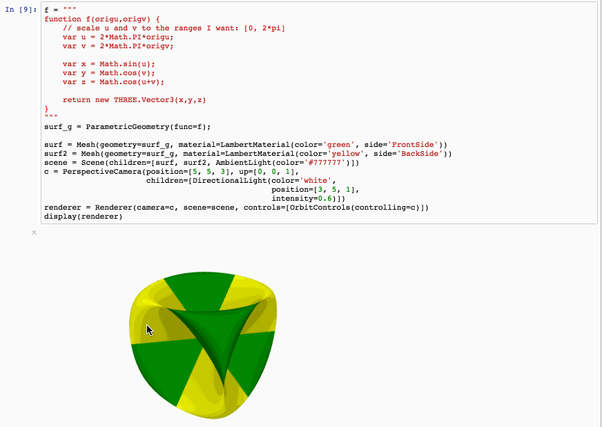

# pythreejs

A Python / ThreeJS bridge utilizing the Jupyter widget infrastructure.



## Getting Started

### Installation

Using pip:

```bash
pip install pythreejs
jupyter nbextension install --py --symlink --sys-prefix pythreejs
jupyter nbextension enable --py --sys-prefix pythreejs
```

Note for developers: the `--symlink` argument on Linux or OS X allows one to
modify the JavaScript code in-place. This feature is not available
with Windows.

Using conda

```bash
conda install -c conda-forge pythreejs
```


## Developers

### Autogen update

This is a _significant_ re-work of the pythreejs extension that introduces an "autogen" script that generates the majority of the ipython-widget code to wrap each of three.js's types.  It also takes a different view towards the pythreejs API.  Whereas pythreejs adds custom functionality to the classes, sometimes renaming, etc., this approach attempts to mimic the low-level three.js API as closely as possible, opening up the possibility for others to build utility libraries on top of this.

The autogen script, `generate-wrappers.js`, takes advantage of a config file `three-class-config.js` to auto-generate both javascript and python files to define the ipywidget wrappers for each three.js class.  The generated javascript files will have `.autogen.js` as the extension.  The generated python files have `_autogen.py` as their extension.  The script uses the handlebars template system to generate the various code files.

The autogen solution allows for overriding the default behavior of the generated classes.  E.g., if `Object3D.js` is present, then it will be loaded into the namespace as opposed to loading `Object3D.autogen.js`.  It is up to the author of the override classe to decide whether to inherit behavior from the autogen class or not.  Same goes for the python modules.  This allows for writing custom methods on both the python and javascript side when needed.

The autogen script relies on a json-like config file (`three-class-config.js`) to describe the classes.  Reasonable defaults should take care of most, but it allows specifying the base class, constructor args, etc. for each of the wrappers.  A base version of this file can be generated by `generate-class-config.js`, but beware, it overwrites any customization to the config file that has already been done.

#### Setup

The relevant commands while working on the repository are included below. These are not meant to be run sequentially, but rather as a list of useful commands:

```bash
# To perform initial dev setup, run:
pip install -e .

# All commands below assume to be in the ./js/ directory
cd ./js/

# To re-generate autogen files, run:
npm run autogen

# To build and install distribution files, run:
npm run build:all
jupyter nbextension install --py --symlink --sys-prefix pythreejs

# To clean out generated files, run:
npm run clean

```
