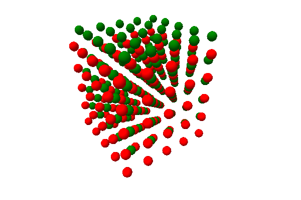

Extending pythreejs
===================

While you can do a lot with pythreejs out of the box, you might have
some custom rendering you want to do, that would be more efficient
to configure as a separate widget. To be able to integrate such
objects with pythreejs, the following extension guide can be helpful.

Blackbox object
---------------

Pythreejs exports a :py:class:`~pythreejs.Blackbox` Widget,
which inherits :py:class:`~pythreejs.Object3D`. The intention is for
third-party widget libraries to inherit from it on both the Python
and JS side. You would add the traits needed to set up your object,
and have the JS side set up the corresponding three.js object. The
three.js object itself would not be synced across the wire, which is
why it is called a blackbox, but you can still manipulate it in a
scene (transforming, putting it as a child, etc.). This can be
very efficient e.g. for complex, generated objects, where the
final three.js data would be prohibitively expensive to synchronize.

Example implementation
**********************

Below is an example implementation for rendering a crystal lattice.
It takes a basis structure, and then tiles copies of this basis
in x/y/z, potentially generating thousands of spheres.

.. note::

    This example is not a good/optimized crystal structure viewer. It is
    merely used to convey the concept of a widget with a few parameters
    translating to something with potentially hugh amounts of data/objects.

Python::

    import traitlets
    import pythreejs

    class CubicLattice(pythreejs.Blackbox):
        _model_module = traitlets.Unicode('my_module_name').tag(sync=True)

        basis = traitlets.List(
            trait=pythreejs.Vector3(),
            default_value=[[0, 0, 0]],
            max_length=5
        ).tag(sync=True)

        repetitions = traitlets.List(
            trait=traitlets.Int(),
            default_value=[5, 5, 5],
            min_length=3,
            max_length=3
        ).tag(sync=True)

JavaScript:

.. code-block:: javascript

    import * as THREE from "three";

    import {
        BlackboxModel
    } from 'jupyter-threejs';

    const atomGeometry = new THREE.SphereBufferGeometry(0.2, 16, 8);
    const atomMaterials = [
        new THREE.MeshLambertMaterial({color: 'red'}),
        new THREE.MeshLambertMaterial({color: 'green'}),
        new THREE.MeshLambertMaterial({color: 'yellow'}),
        new THREE.MeshLambertMaterial({color: 'blue'}),
        new THREE.MeshLambertMaterial({color: 'cyan'}),
    ];

    export class CubicLatticeModel extends BlackboxModel {
        defaults() {
            return {...super.defaults(), ...{
                _model_name: 'CubicLatticeModel',
                _model_module: 'my_module_name',
                basis: [[0, 0, 0]],
                repetitions: [5, 5, 5],
            }};
        }

        // This method is called to create the three.js object of the model:
        constructThreeObject() {
            const root = new THREE.Group();
            // Create the children of this group:
            // This is the part that is specific to this example
            this.createLattice(root);
            return root;
        }

        // This method is called whenever the model changes:
        onChange(model, options) {
            super.onChange(model, options);
            // If any of the parameters change, simply rebuild children:
            this.createLattice();
        }

        // Our custom method to build the lattice:
        createLattice(obj) {
            obj = obj || this.obj;

            // Set up the basis to tile:
            const basisInput = this.get('basis');
            const basis = new THREE.Group();
            for (let i=0; i < basisInput.length; ++i) {
                let mesh = new THREE.Mesh(atomGeometry, atomMaterials[i]);
                mesh.position.fromArray(basisInput[i]);
                basis.add(mesh);
            }

            // Tile in x, y, z:
            const [nx, ny, nz] = this.get('repetitions');
            const children = [];
            for (let x = 0; x < nx; ++x) {
                for (let y = 0; y < ny; ++y) {
                    for (let z = 0; z < nz; ++z) {
                        let copy = basis.clone();
                        copy.position.set(x, y, z);
                        children.push(copy);
                    }
                }
            }

            obj.remove(...obj.children);
            obj.add(...children);
        }
    }

This code should then be wrapped up in a widget extension (see
documentation from ipywidgets on how to do this).

Usage::

    import pythreejs
    from IPython.display import display
    from my_module import CubicLattice

    lattice = CubicLattice(basis=[[0,0,0], [0.5, 0.5, 0.5]])

    # Preview the lattice directly:
    display(lattice)

    # Or put it in a scene:
    width=600
    height=400
    key_light = pythreejs.DirectionalLight(position=[-5, 5, 3], intensity=0.7)
    ambient_light = pythreejs.AmbientLight(color='#777777')

    camera = pythreejs.PerspectiveCamera(
        position=[-5, 0, -5],
        children=[
            # Have the key light follow the camera:
            key_light
        ],
        aspect=width/height,
    )
    control = pythreejs.OrbitControls(controlling=camera)

    scene = pythreejs.Scene(children=[lattice, camera, ambient_light])

    renderer = pythreejs.Renderer(camera=camera,
                                  scene=scene,
                                  controls=[control],
                                  width=width, height=height)

    display(renderer)

   Figure: Example view of the rendered lattice object.
